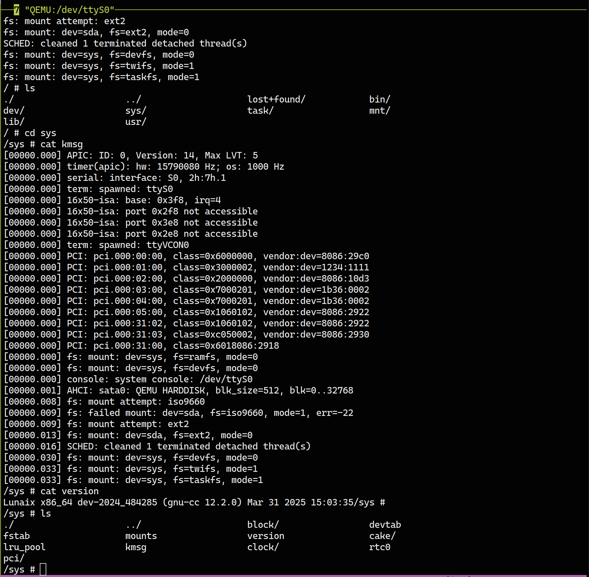
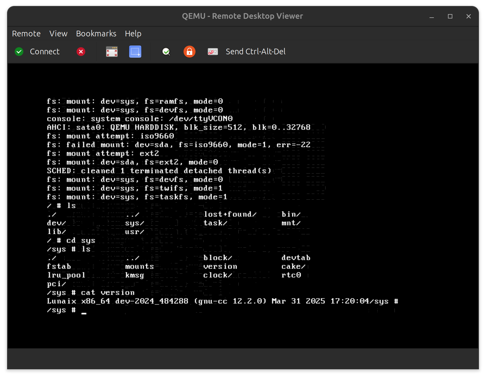

<p align="center">
  
</p>

<p align="center">
  <a href="docs/README.cn.md">简体中文</a> | <a href="#the-lunaixos-project">English</a>
</p>

# The Lunaix Project

The Lunaix kernel (or soon-to-be LunaixOS) is a hobby kernel, started in 2022, 
written entirely from scratch. With a big ambition of being POSIX-compliance, 
and designed with performance and modernity in mind, with some independent 
thoughts being applied in architectural design.


This project is built entirely from first principles - meaning no code was 
copy-pasted or recycled from other OS projects or tutorials. Lunaix didn't begin 
as an attempt to outperform anything; it started as a personal challenge to 
learn OS theory and explore advanced kernel features through original design 
and implementation. Everything you see here was developed solo, part-time, 
with only hardware specs and my beloved **Modern Operating Systems** as guidance.

If you're a kernel hobbyist looking for a fresh take or tired of mass-produced, tutorial-style 
projects, then welcome, you're in the right place!


|  |
|:--:|
| *Lunaix over serial* (`console=/dev/ttyS0`) |

|  |
|:--:|
| *Lunaix over VGA text mode* (`console=/dev/ttyVCON0`) |

> By the way, do you know there is an online video course  by the author on the design of lunaix? [Check it out](https://space.bilibili.com/12995787/channel/collectiondetail?sid=196337) (although it is in Chinese!)

## Features

Lunaix is a multi-architecture, general-purpose kernel built with performance, 
modularity, and robustness in mind. Its design emphasizes advanced abstractions, 
proactive error detection, and subsystem isolation. Lunaix is

+ **Fully-preemptive** for responsive multi-tasking
+ **Modular** with compile-time configurable components and extensible 
  subsystems
+ **High-performance**, leveraging modern caching strategies and efficient 
  infrastructures.
+ **Fault-tolerant**, with built-in error handling and stack backtracing
+ **Robust by design**, using mechanisms like proactive deadlock detection 
  and driver isolation

A significant amount of effort has gone into crafting clean abstractions, 
implementing advanced kernel features, and applying performance optimizations 
throughout the system.

To better illustrate the scope of work already done, the following non-exhaustive 
list outlines currently supported features in Lunaix:

### List of All Features
<details>

<summary>Click to Expand</summary>

+ Multi-ISA
  + x86_32
  + x86_64
  + Aarch64 (WIP)
+ Boot protocol
  + abstraction for different protocol
  + configurable kernel boot-time parameters
+ Platform resource management and definition
  + read-only ACPI table interpretation
  + full devicetree implementation
+ Memory management
  + architecture-neutral abstraction
  + highmem
  + copy-on-write
  + page sharing
  + explicit huge page
  + on-demand paging
  + compound page
  + reverse mapping (rmap)
  + memory compaction (WIP)
  + slab-style object allocator
  + inter-process address space access
+ Multi-tasking
  + fully preemptive
  + protection levels
  + process isolation
  + native threading
  + signal mechanism
  + round-robin scheduler (for now)
  + kernel level multi-tasking (i.e. kernel threads)
  + taskfs: file system interface to process and threads
+ File system
  + POSIX-compliant interface
  + virtual file system framework
  + file system mounting mechanism
  + page cache for file IO
  + inode/dnode caching
  + ext2 (rev.0, rev.1)
  + iso9660 (rock-ridge)
  + twifs: kernel state fs interface.
+ Device management and interrupt handling
  + unified IRQ framework
  + unified driver framework for heterogenous devices
  + modular driver model allow compiled-time toggling
  + asynchronous operation model supported
  + devfs: device fs interface.
+ Block I/O (blkio)
  + unified block IO interface
  + IO request packets caching
  + asynchronous IO operation
+ Serial I/O
  + POSIX-compliant serial IO model
+ Caching Infrastructure
  + LRU replacement policy and pooling
  + kernel daemon for dynamic and transparent cache managements
+ Error handling and detection
  + stack backtracing with symbol resolution
  + stack unwinding for nested exception
  + CPU state dumping
  + deadlock/hung-up detection

</details>

### List of Built-in Drivers

<details>

<summary>Click to Expand</summary>

+ Architecture Neutral
  + UART 16650-compatible driver
  + Serial ATA AHCI
  + PCI 3.0
  + PCIe 1.1
  + Standard VGA
+ Intel x86
  + RTC (Intel PCH)
  + IOAPIC IRQ controller
  + APIC Timer
  + Legacy i8042 keyboard controller
+ ARM
  + GICv3
  + PL011 (WIP)
</details>

## Documentations

There are documentations avaliable if you want to dig deeper. Keep in mind they are still work in progress and missing localisation.

+ [Luna's Tour - Into Lunaix's Inner Workings](docs/lunaix-internal.md)
+ [Syscall Number Assignments](docs/lunaix-syscall-table.md)

## Compile and Build

Building lunaix is simple, no more bloated dependencies to install, basic 
`build-essentials` installation plus a python are sufficient.

+ gcc (recommend v12+)
+ binutils
+ make
+ python (recommend v3.11+)

And also one should have environment variable `ARCH=<arch>` exported, where 
`<arch>` is one of the supported arhcitecture (`x86_32`, `x86_64`, `aarch64`).

For cross compilation, also export `CX_PREFIX` to the gcc prefix for the 
corresponding `<arch>`.

The following `make` actions are then available to use.

| Make command | Usage |
| ---- | ---- |
| `make all`               | Build the kernel bin |
| `make rootfs`            | Build the stock rootfs |
| `make clean`             | clean |
| `make config`            | run configuration tool |
| `make reconfig`          | revert to default and restart configuration |

A successful build will give `build/bin/kernel.bin`.

> Please note: this is the kernel, not a bootable image, it require a bootloader 
> to boot and specify the rootfs.

## Get Started

If you are impatient, or just want something to run and don't want to went 
through tedious process of configuring rootfs and tweak kernel parameters. You 
can use the `live_debug.sh` provided in the lunaix root directory to quickly 
bring up the system with default parameters (also used by the author for 
debugging).

### Quick Start

This will get you up and running real quick. We will use `x86_64` as example.

Assuming a Linux or other Unix-like shell environment. We also expect you to be able to sort out trivial issues like missing packages.

**Select your target**
```sh
$ export ARCH=x86_64
```

**Check Python**
```sh
$ python --version
```

Ensure at least `3.11`

**Check compiler**
```sh
$ gcc -dumpmachine
```

Ensure `x86_64-linux-gnu` or anything resemble `x86_64`

**Check QEMU**
```sh
$ which qemu-system-x86_64
```

Should display a valid installation path

**Optional: Setting up Cross-Compiler**

```sh
$ export CX_PREFIX=x86_64-linux-gnu-
```

**Run Configuration**
```sh
make config
```

Then hitting `q` in the interactive shell to accept default setting.

**Build stock rootfs**

```sh
make rootfs
```

Note, this requires root for creating fs image. You can check script `lunaix-os/scripts/mkrootfs` if you feel uncertain.

**Build & Run**
```sh
./live_debug.sh
```

you should see gdb now take control of your shell

**Connect to serial via telnet**

Open up another window or session
```sh
telnet localhost 12345
```

**Commence simulation**

Back to the gdb session and type `c` to countine


**Watch Lunaix booting!**

Congrats, enjoy your lunaix! (or submit an issue)


### Not so Quick Start

Here is a slower and yet more verbose steps:

1. Select an architecture `<arch>`
2. Check the compilation prerequisites and presence of `qemu-system-<arch>`
3. Optionally export `CX_PREFIX` if you are building for another architecture.
4. Run `make ARCH=<arch> rootfs` to build stock rootfs image, require support 
   of `dd`，`mkfs.ext2`, `mount -o loop`, `mktemp`.
5. Run `ARCH=<arch> live_debug.sh` to boot in QEMU with gdb hooked (one should 
   see a gdb session)
6. telnet to `localhost:12345`, this is QEMU emulated serial port
7. type `c` in the active gdb session and commence emulation.
8. Congrats, enjoy your lunaix!
(or submit an issue)


## Booting the kernel

Since lunaix is a kernel, much like linux. It requires additional setup to do 
the magic. And, as in "much like linux", methods to make linux kernel boot can 
also apply to lunaix without or with little translation, as we will discuss 
below.

The bootloader part is generic, any bootloader, for example GRUB will work (not 
tested for UEFI, but I expect this would be an exception), or booting up in QEMU 
using `-kernel` option

The kernel command line, is however, a bit differentiated.
The syntax is similar, both takes form of space-separated array of `<key>=<val>` 
pairs or boolean `<flag>`.

Currently, lunaix support the following options

| Option | Default Value | Optional | Usage |
| ------ | ----          |  -----   | ----  |
| console | `/dev/ttyS0`   | No | Specify the system console device, path within lunaix's devfs |
| rootfs | `/dev/block/sda` | No | Specify the device contain rootfs image, path within lunaix's devfs |
| init | `/init` | Yes | Path within rootfs of the `init` |


## Submit an Issue

If one ran into bug, one can submit an issue by filling up the following template

```
1. Describe the problem
    "How does it look like, anything descriptive: visual, sonic, emotional experience"

2. Steps to reproduce
    "How you ran into this mess?"

3. Expected behaviour
    "What do you intended/expected to achieve/to be"

4. Lunaix's panic trace (if applicable)

5. Other clues that you think might be helpful
```


## Limitations

The development process is still in motion, any limitation can be categorised as 
a feature yet to be. However, some features that the author considered to be the 
most urgent and wish the matters to be discussed.

Lunaix is under impression of uniprocessor and not capable of running in SMP 
environment. This is major held back of being a modern operating system. It has 
the highest priority among all other tasks

Lunaix do not have a mature (or even, an infant) user space ecosystem, mainly 
because the lack of a proper and sophisticated libc. Efforts need to be done for 
porting one to the target. However, given the author's tight schedule, this task 
is unfortunately still beyond the horizon.

## Acknowledgement

Albeit one must realise that the author has mentioned it in the very beginning, 
the author would like to emphaise **again** on the nature of this project.

As a personal challenge, this project is independently developed by the author 
single-handly, which means:

+ No reference to existing tutorials, books, online courses or any open source 
  project that might provide any example, hint or working prototype on the 
  design and implementation of kernel, subsystems or anythings that can be 
  contributed towards a working prototype.
+ The author has no prior knowledge on Linux kernel through out 90% of the 
  project time.
+ All knowledge on the kernel design is coming from the basic textbook on 
  operating system theory, that is, *Modern Operating System* by Tanenbaum.
+ All knowledge on the system programming is coming from the basic textbook, 
  that is, *Computer System - A Programmer's Perspective Third Edition*
+ All knowledge on the generic framework design and driver development are 
  ingested from various technical specifications gathered across the Internet.

## References

+ Intel 64 and IA-32 Architecture Software Developer's Manual (Full Volume Bundle)
+ ACPI Specification (version 6.4)
+ Devicetree Specification
+ ARM® Generic Interrupt Controller (v3)
+ Arm® Architecture Reference Manual (Profile-A)
+ Procedure Call Standard for the Arm® 64-bit Architecture (AArch64)
+ IBM PC/AT Technical Reference
+ IBM VGA/XGA Technical Reference
+ 82093AA I/O Advanced Programmable Controller (IOAPIC) (Datasheet)
+ MC146818A (Datasheet)
+ Intel 500 Series Chipset Family Platform Controller Hub (Datasheet - Volume 2)
+ PCI Local Bus Specification, Revision 3.0
+ PCI Express Base Specification, Revision 1.1
+ PCI Firmware Specification, Revision 3.0
+ Serial ATA - Advanced Host Controller Interface (AHCI), Revision 1.3.1
+ Serial ATA: High Speed Serialized AT Attachment, Revision 3.2
+ SCSI Command Reference Manual
+ ATA/ATAPI Command Set - 3 (ACS-3)
+ ECMA-119 (ISO9660)
+ Rock Ridge Interchange Protocol (RRIP: IEEE P1282)
+ System Use Sharing Protocol (SUSP: IEEE P1281)
+ Tool Interface Standard (TIS) Portable Formats Specification (Version 1.1)
+ *Computer System - A Programmer's Perspective Third Edition* (Bryant, R & O'Hallaron, D), a.k.a. CS:APP
+ *Modern Operating System* (Tanenbaum, A)
+ Free VGA, http://www.osdever.net/FreeVGA/home.htm 
+ GNU CC & LD online documentation.
+ PCI Lookup, https://www.pcilookup.com/
+ Linux man pages

## Appendix 1: Supported System Call<a id="appendix1"></a>

Refer to [Lunaix Syscall Table](docs/lunaix-syscall-table.md)

## Appendix 2: Debugging with GDB remotely via UART

**(((( Broken after a refactoring years ago, need rework ))))**

<details>
<summary> Click to expand </summary>
The LunaixOS kernel comes with a built-in GDB debugging server, which runs on 
COM1@9600Bd. However, LunaixOS must be in debug mode before involving GDB.

One could trigger the debug mode by writing a byte sequence `0x40` `0x63` `0x6D` 
`0x63`, to the same serial port. A text "DEBUG MODE" with magenta-coloured background shall be present at the bottom of the screen.

Note that, whenever the text appears, the LunaixOS always halt all activities 
other than the debugging server, which means no scheduling and no external 
interrupt servicing. Users are now recommended to attach their GDB and drive 
the kernel with the debugging workflow.

Currently, LunaixOS implements the required minimal server-side command subset 
required by GDB Remote Protocol, namely, `g`, `G`, `p`, `P`, `Q`, `S`, `k`, `?`, 
`m`, `M`, `X`. Which should be enough to cover most debugging activities.

When debugging is finished, one shall disconnect with `kill` command. This 
command will not force LunaixOS to power down the computer, instead it just 
resume the execution (identical behavior as `c` command). However, disconnecting 
does not means exiting of debug mode. The debug mode is still actived and any 
subsequent GDB attaching request shall remain the highest priority amongst all 
other activity. One shall deactivate the debug mode by writing byte sequence 
`0x40` `0x79` `0x61` `0x79` to the port, after GDB detached.

### Limitations

Currently, one should avoid the use of `info stack`, `bt` or any other command 
that involves stack unwinding or stack backtracing. As it will somehow corrupt 
the stack layout and result in undefined behaviour. This issue should be 
addressed in future releases.
</details>