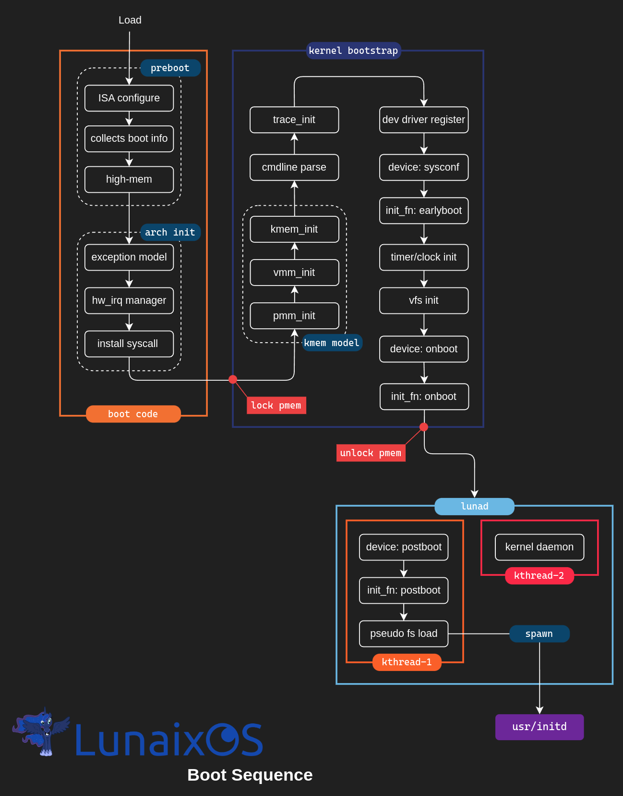

# Lunaix内核初始化流程

虽然不同的架构对启动与初始化有着不同的要求，但这些区分仅仅只是出现在针对与架构特性与功能的初始化层面上。对于架构中性的内核而言，其初始化流程是保持不变的。

下图展示了从内核被引导，及至第一个用户进程的创建，这之间的流程。

## 图例与解释

### 1. 架构相关
+ **ISA Config** 
  对CPU状态进行而外的配置，如进行模式切换，开启或关闭CPU特性。该部分代码为架构相关，如果某些架构没有这个需求，那么该步骤将只是一个单纯的占位符，以满足Lunaix的规范。
+ **collect boot info**
  收集引导信息，以及平台信息。比如内存地图，内核启动参数的存放地址。
+ **high-mem**
  配置内核的虚拟地址资源，包括：按照[虚拟内存地址映射图](./lunaix-mem-map.md)进行页表的构建，以及将内核重映射到高内存区。
+ **exception model** 
  初始化CPU的异常模型（或者也叫中断模型），包括：安装异常处理函数，配置CPU使得其按照Lunaix预定的方式进行异常的接受和分派。
+ **hw_irq manager**
  初始化硬件中断资源管理器。该组件用于管理外部中断号的分配，比如：当一个驱动程序想获得一个中断号以便配置与相应该设备的中断。
+ **install syscall**
  安装系统调用接口

### 2. 架构中性

+ **pmm_init**
  初始化物理管理器，主要包括：内存页池创建，分配器初始化。
+ **vmm_init**
  初始化虚拟内存管理器（该步骤目前没有任何行为）
+ **kmem_init**
  初始化内核内存管理器，主要包括：蛋糕分配器初始化（Lunaix内核的动态内存分配器，是slab分配器的一个变体）
+ **cmdline parse**
  解析内核启动参数，方便其他组件随时取阅。
+ **trace_init**
  初始化内核跟踪器，用于在内核出现无法恢复的致命错误时，打印出详尽的调试信息，并跟踪堆栈。
+ **dev driver**
  扫描并注册所有的编译进内核的设备驱动程序
+ **device: (stage)**
  加载驱动程序。注意，该步骤是参数化的。驱动程序可能对加载的时序有要求，不同的驱动需要在内核启动过程中不同的时刻加载。该时刻由参数`stage`定义，每一次调用该步骤只会加载注册在指定时刻下的驱动程序。
  这里需要明确指出一点：该步骤只是负责运行驱动程序的安装函数。如果一个驱动程序在该平台上找不到兼容的设备进行认领，则可以选择忽略本次运行。安装函数可以在内核进入正常的工作序列后，由用户通过`twifs`暴露的接口进行手动执行。
  Lunaix目前规定了以下几个时刻
  + **sysconf**
    序章时刻。驱动程序所能使用的内核组件只有最基本的内存管理服务，以及中断资源管理服务。其他组件/服务处于未定义阶段。像ACPI，芯片组这类的驱动程序一般会在这个时候进行加载。
  + **onboot**
    正文时刻。在这个时刻，基本上所有的内核服务都可以使用，比如：时钟/计时器服务，虚拟文件系统，调度服务，块儿设备IO。大部分驱动程序将会在此时加载。
  + **postboot**
    终章时刻。在这个时刻与正文时刻几乎一样。但不同于正文时——其运行在同步模式，该时刻的驱动运行在抢占模式，也就是内核线程已经开始进入正常的调度序列。
+ **init_fn: (stage)**
  加载内核组件初始化程序。注意，该步骤是参数化的。初始化程序可能对加载的时序有要求，不同的初始化程序需要在内核启动过程中不同的时刻加载。该时刻由参数`stage`定义，每一次调用该步骤只会加载注册在指定时刻下的初始化程序。Lunaix目前规定了以下几个时刻
  + **earlyboot**
    序章时刻。在驱动程序的序章时刻后进行。
  + **onboot**
    正文时刻。在驱动程序的正文时刻后进行。
  + **postboot**
    终章时刻。在驱动程序的终章时刻后进行。
+ **timer/clock init**
  计数器与系统时钟的初始化。前者负责控制整个系统的时序，提供精确到毫秒或以下（取决于架构）的计时服务；后者构建与前者与RTC设备之上，提供基本的时间播报与统计服务（如当前的时间戳，系统运行时间，等等）
+ **vfs init**
  虚拟文件系统初始化，同时加载文件系统驱动。
+ **pseudo fs load**
  伪文件系统加载（如`twifs`，`devfs`）
+ **kernel daemon**
  内核守护线程，用于重复执行一些具有维护性的例程（如LRU检查，僵尸线程自动回收）
+ **lock pmem**
  冻结物理内存。用于“锁住”包含启动时所需信息的物理页，这类页面一般由固件提供，以便OS能够更好的进行适配。如ACPI的系统描述表们。该类页面将在 **unlock pmem** 时分释放。
+ **unlock pmem**
  解冻物理内存。
