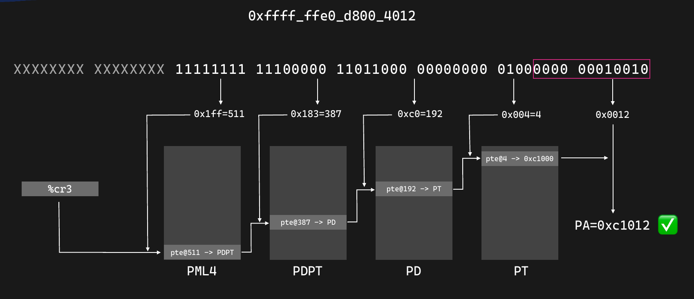
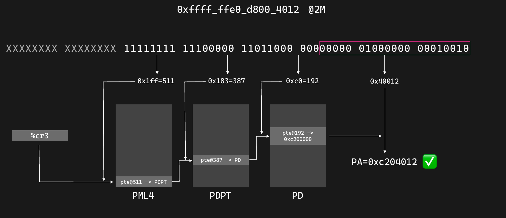
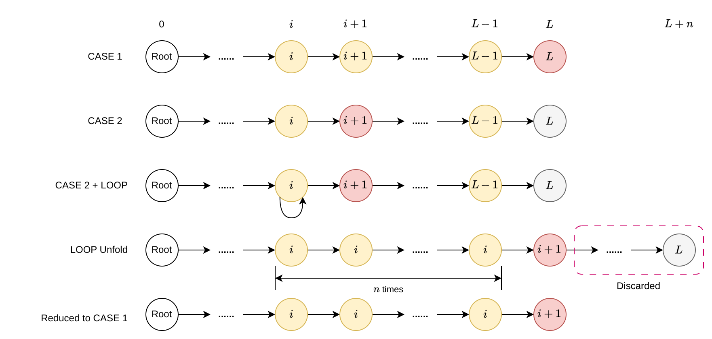
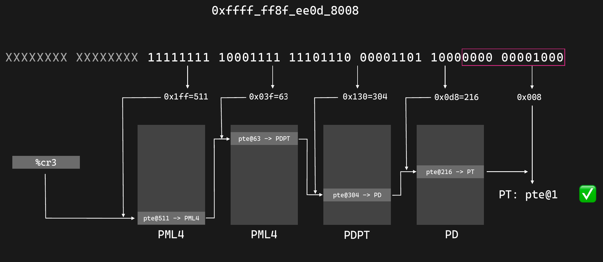
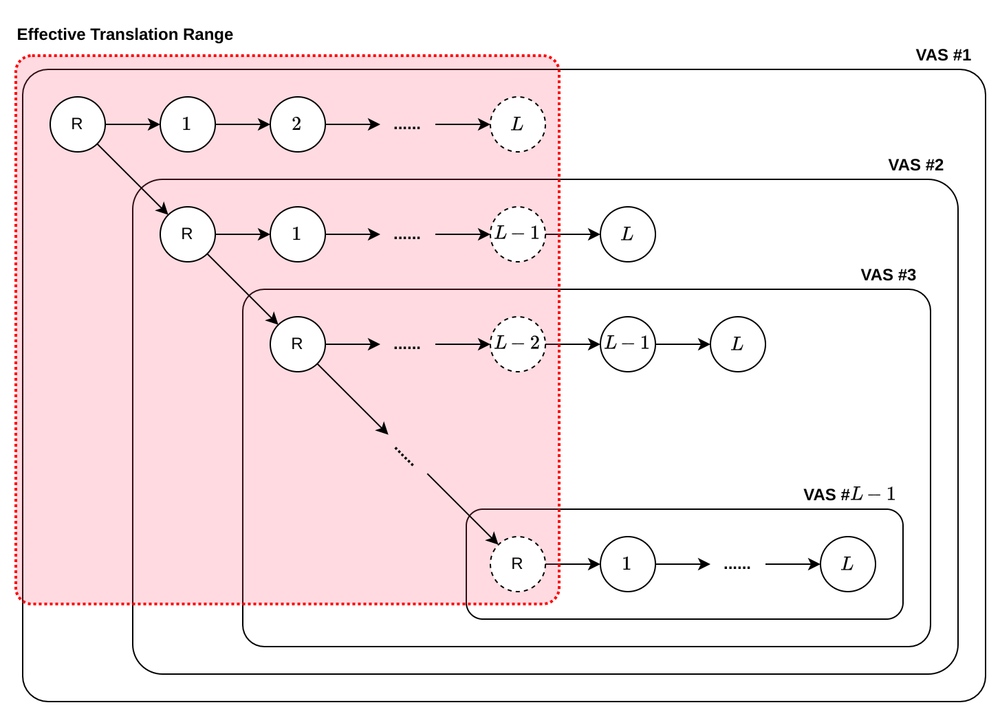
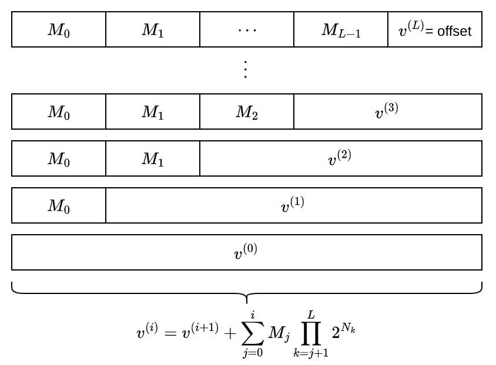
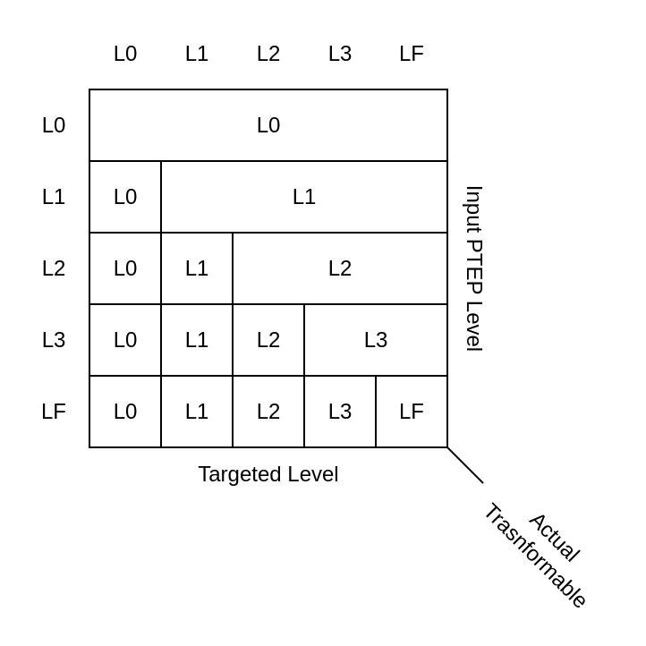
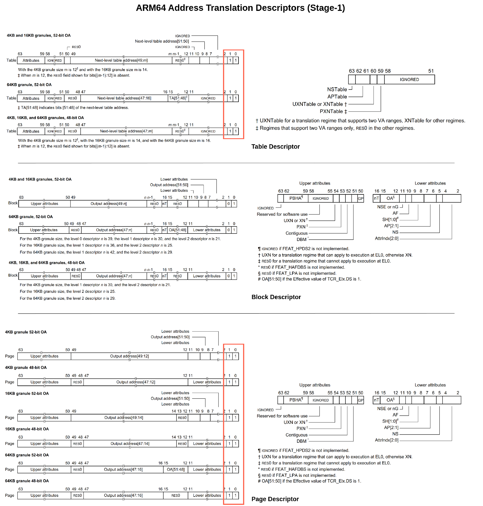
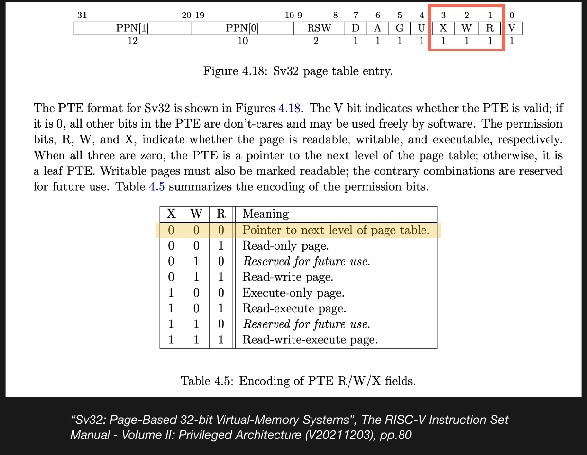

# 虚拟内存模型之设计

在我看来，内核中的虚拟内存是一个既简单又复杂的话题：它十分的简单与基础，它的核心概念以各种最浅显易懂的话语出没在各种网站与教科书中，新起的LLM 更是进一步拉低了门槛。于是，哪怕是一个小学生——假若他有足够用的兴趣——都能够极快的领悟，与实现最基本的x86\_32 架构下的分页操作，而后加入业余OS开发者的大圈子；可是它又那么的复杂与困难，在 Linux 内核的三十多年的历史中，其内存管理板块（mm）每天都有新的 patch 被提交，无数的优化，改进，重构方案被提出与执行，一整个研究领域围绕着虚拟内存建立起来……

正是这样一种悖论似的深度与广度，导致许多业余内核的开发者都低估了这一系统的重要性，所以我们也就看到许多自制操作系统的内存管理模块都是处在“三十天入门”的，教程级的状态，尽管他们已经拥有了媲美主流桌面系统的UI和设备驱动的支持。这样一来，也就使得这些“操作系统”并不具备真正的普适性以及多平台可移植性，因为若是进行这样的壮举，一个最大的阻碍自然就是那早已与架构强绑定的内存模型。

我想这个时候可能有许多人已不赞同，而想要愤怒地发表议论——是的，“点到为止”的实现并不就意味着不好，因为每个自制OS的人都有自己的目的：有些人可能是为了学习，有些人可能是奔着那炫酷的UI，也有些人是带着研究与实验目的。Lunaix 是属于最前者与最后者的结合，以学习为目的而开始，又因为野心而转变为一个研究与实验的场所。那么对虚拟内存的重构，便是这一转变的最佳体现，这是为了向一个更为宏伟的目标前进而所作迈出的一步。

那这篇文章便是来为大家介绍“统一虚拟内存模型（**U**nified **V**irtual **M**emory **M**odel, UVMM）”的设计与实现。

## 为什么需要统一虚拟内存模型

在上述的引言处，我已经阐述了内存模型跨平台和可移植的重要性。至于这种重要性的体现而带来的挑战，许多业余OS开发者似乎并没有一个非常全面的认知——也就是说，许多人都严重低估了指令集架构与其蕴含的编程模型的多样性。根据我的观察，这些多样性主要体现在以下几个方面：

1. **页表描述符之格式** 这个是最为显然的观察，一个只在x86生态圈里游荡的开发者都能够立刻在32和64位的区别中发现这一差异。其主要的体现就是每个页表描述符——或者是页表项——内部字段的布局和含义，甚至是页表项本身的长度（如armv9.3 引入的 FEAT_D128 特性规定了128位PTE的使用）

2. **地址翻译之策略** 从大体上来讲，不论是何种ISA，目前虚拟地址的翻译基本上和80年代虚拟内存问世之时没有任何特别大的差别，即对前缀树的查找。不过需要特别注意的是，有一些架构会因为诸如优化，需求，或者其他种种原因，在此基础上进行一些程度的创新或修改。一个最有名的例子便是 arm 架构。从 v8.0 时期开始，arm 就允许 *同时* 指定两个不同的虚拟地址空间（TTBR0, TTBR1），通过64位的虚拟地址的高位空闲比特来动态选择（注意区分 Address Tagging，这是个相反的概念）。除此之外，arm 也允许通过对 TCR 的动态编程来支持“各向异性”的MMU配置——如不同的基础页粒度（4K, 16K，64K），不同的虚拟地址长度（48位，52位）；而这也造就了一种相当极端的情况：即每个进程从原则上讲都可以选择其偏好的MMU配置。而这样做的目的其实是为了将设计空间的探索权下放给用户，允许不同的用户根据具体的需求进行具体的优化。

3. **编程范式之模型** 既然每个架构有自己独特的风格，整个虚拟内存的编程范式自然需跟着独特了。比如不同的寄存器，发生页错误时不同的处理机制，不同得到权限配置选项，甚至说一些相当独特的优化机制。总而言之，这是另一个相当的广的话题，值得一篇单独的文章去深究，我就不在这里进行逐一的的列举和讲解了。

而我们的统一虚拟内存模型就是为了将上述三大类进行一个归一化的处理，通过对比与提取其中的相同之处，从而设计一套通用的接口，将架构无关的内存管理逻辑与具体的架构实现进行彻底的解耦。在接下来的篇幅中，我将主要探讨对第一类和第二类的统一：我会首先来带大家重新温习一下教科书的虚拟内存之概念，而后由这些概念中推广出一些接口，并且提出“回环映射”的页表操作范式，并对这种操作范式进行充分的，有关接口设计，性能的讨论，并从中发现出一些其独有的弊端。

## 虚拟内存作为物理内存的虚拟表征

### 再论地址翻译

从本质上来看，虚拟内存是定义了一个由虚拟地址到物理地址的满射函数（Surjection），即多个虚拟地址可以映射到同一个物理地址。具体的映射关系可以由软件进行定义，而由这些不同的定义所产生的函数也就构成了相互独立且封闭的虚拟地址空间。对于这种函数而言，目前最为广为流传的一个表示方法就是通过前缀树的形式，将物理地址作为子叶节点，而把虚拟地址作为从树根到达子叶节点的路经描述。这种树形结构的通常具有以下的特征：

+ **（特征一）** 每个节点的自有属性由最少为一字长的描述符所表征。
+ **（特征二）** 每个节点表征一个任意的物理页。
+ **（特征三）** 每个根节点的子节点的最大数量 $N$ 由物理页的大小 $B$（即基础页大小，或者是粒度）以及描述符大小$l$ 所决定 （ $N=Bl^{-1}$ ）。
+ **（特征四）** 高度$L$ 取决于虚拟地址长度$A$，基础页大小以及单个节点的子节点的最大数量。（$L=(A-\log_{2}{B})N^{-1}$ ）
+ **（特征五）** 结构不具备完全性（即不为满树）。
+ **（特征六）** 空节点不意味着子叶节点，反之亦然。

那么，所谓的地址翻译其实就可以看作为对该树形结构的查找。这种查找是具有目的性与局限性的，也就是说，我们是根据一个确定的路线（虚拟地址）去按部就班的“走”到我们所需要的页面，而不是传统意义上的，带有遍历性质的搜索。如果我们仔细的按照前缀树的思维模型去思考，我们可以进一步发现该查找是具有以下的性质：

+ **（性质一）** 查找路径上的每个节点都需要进行属性校验。
+ **（性质二）** 虚拟地址表示查找路径，最多有 $L$ 个路径节点。
+ **（性质三）** 虚拟地址中剩余的位数将会作为页内偏移，结合路径上最后一个节点蕴含的物理页地址推断出最后的物理地址。
+ **（性质四）** 每层所代表的虚拟地址空间大小为 $B\cdot N^{L-i-1}$，其中$i\in [0,L)$ 为当前层深。而每往下降一层，所代表的地址空间大小便会缩减为原来的 $\frac{1}{N}$ 倍。
+ **（性质五）** 由特性五，性质四所知，子叶可以出现在任意层级；即我们可以发现存在大小为 $B\cdot N^{L-i-1}$ 字节的物理页面，这种页面我们一般称之为巨页（Huge Page）。
+ **（性质六）** 由特征六，性质一可知，游走会出现异常的中断，通常体现为属性校验的失败，或者是缺失的子叶节点。这两种类型的问题我们可以归类为“页错误（Page Fault）” 的两大根源。

于是，我们也就获得了一个对于地址翻译的抽象表征；特别的，我们可以将任意一个基于此模型的地址翻译模型 表示为一个三元组$(A, B, l)$ 。从这里，我们可以推导出一切指令集架构的地址翻译方式。

> [!IMPORTANT]
> 需要特别提醒，这个模型是我简化过后的，因为我不想参杂太多的数学在里头，毕竟绝大多数的内核开发者并不喜欢太多的公式。该模型仅适用于采用常规的地址翻译实现的架构，如x86，riscv，以及arm 的某些模式。因为这个模型假设了 $N$ 在各个层级是相同的。而arm 的48位虚拟地址位宽与32K，64K 粒度的模式搭配则不属于这个假设的范畴。所以，正确的模型应该是将 $N$ 进行分类讨论，即 $N_i$ 。那么第 $i$ 层地址空间的大小，以及巨页大小则需表示为 
> $$ B\prod_{j=i}^{L-1}{N_{j}} $$
> 同理，$N$ 也就必须作为其中一个参数，与之关联的 $L$ 也必须如此。于是非常不幸的，整个翻译步骤的表征也就是一个令人遗憾的五元组，而不是三元组了： $(A, B, l, L, \mathcal{N})$，其中 $\mathcal{N}=\{N_0,\dots,N_{L-1}\}$
> 

我们在这里以 `x86_64` 作为样例进行分析。我们定义`x86_64` 的三元组：$(48, 4096, 8)$ ；令一虚拟地址 $v= \text{0xffffffe0d8004012}$ 。通过将行走路径展开，我们便可以获得一个教科书试的连级查表结构。



对于巨页的情况也是类似。在上述例子中，我们假设子叶节点位于最末层。现在我们将其提升至倒数第二层，也就是说第三层（$i=2$），根据我们建立的关系，这个巨页的大小为 $4096\cdot 512^{4-2-1}=2097152=2 \text{ Mb}$ 。




### 页表项作为物理页的元数据

我们已经为地址翻译下了一个比较好的定义。而聪明的读者已经发现，节点属性（页属性）的校验在翻译的过程中扮演了一个十分重要的角色，因为那直接影响整个流程的成败。不过遗憾的是，我们没有办法像针对地址翻译那样为属性位下一个很严谨的定义，因为正如同我们在前面多样性的调查中所宣称的那样，这里是最为混乱的地方。所以这也就意味着，许多属性位的利用必须得要放在UVMM 这层抽象接口之下，即由架构相关实现来负责。

不过这并不意味着我们已经无计可施了。假若我们仔细观察，我们可以从事实上发现所谓的这些“多样程度”几乎都是和微架构特性所带来的优化措施有着相当直接的关联，比如arm 和riscv 的连续页标志位。所以，尽管这些属性位的具体设置还需有架构相关代码负责，但我们还是可以从功能层面上找到一下共同性的：

+ **（功能一）** 节点类型的指示。可以分为三类：子节点（页表），半途子叶节点（巨页），末层子叶节点（标准页）。这是我们先前建立的地址翻译模型的必然结果。
+ **（功能二）** 访问控制。安全性是一个老生常谈的话题。大概来看，一个页面最基础的保护措施无非就是这几个考虑：是否可写 (WR/WO)，是否可读 (RD/RO)，是否可执行 (X/nX)，对访问者的限制 (U/S)（用户还是内核，或者说 **权限层级 (Privilege Level)**）。这里最多有十六种不同的权限搭配。
+ **（功能三）** 内存类型。控制其中的数据的缓存层级，以及缓存同步的方式。这里面很大一部分主要是缓存一致性的直接结果，在多核模式（SMP）下有着重大的意义，比如内共享，外共享的区别。另一些如预读取，回写与透写的设置则主要在MMIO 的场景下扮演重要角色。
+ **（功能四）** 物理页指针，物理页的物理地址。存放实际的数据（子叶节点），或者作为其他子节点的容器。虽然严格上来讲，这个不算是一个属性，不过考虑到其也是作为元数据的形式呈现（即PTE 中的某个比特字段），所以依然将其划分为一个“属性位”，以保持我们讨论的完整性。
+ **（功能五）** 状态标志位。告知当前页面的访问状态：是否已被访问 (A)，内容是否被修改 (D)。通常来讲，这些位是由硬件进行透明的更改，软件只需要可选的做复位。但有些架构，比如arm，其硬件管理的访问位（FEAT_HAFDBS, FEAT_HAFT）以及硬件标脏（FEAT_HAFDBS）均为可选功能，也就是说，软件必须要预留出软件管理的途径，一般需要在页错误中断处理函数中进行一些额外的判断与处理。

尽管我并没有把每个功能的选项都列举出来，我相信聪明的读者已经感知到了那个我们所需要的接口的最小集合了——其本质就是一堆的架构无关的，功能抽象出来的宏定义，具体的搭配由架构相关的代码决定。这里我以 `x86_64` 作为例子给大家体会一下。

```c
#define _PTE_P                  (1UL << 0)
#define _PTE_W                  (1UL << 1)
#define _PTE_U                  (1UL << 2)
#define _PTE_WT                 (1UL << 3)
#define _PTE_CD                 (1UL << 4)
#define _PTE_A                  (1UL << 5)
#define _PTE_D                  (1UL << 6)
#define _PTE_PS                 (1UL << 7)
#define _PTE_PAT                (1UL << 7)
#define _PTE_G                  (1UL << 8)
#define _PTE_NX                 (1UL << 63)
#define _PTE_X                  (0)
#define _PTE_R                  (0)

.....

#define KERNEL_PAGE             ( _PTE_P )
#define KERNEL_EXEC             ( KERNEL_PAGE | _PTE_X )
#define KERNEL_DATA             ( KERNEL_PAGE | _PTE_W | _PTE_NX )
#define KERNEL_RDONLY           ( KERNEL_PAGE | _PTE_NX )
#define KERNEL_ROEXEC           ( KERNEL_PAGE | _PTE_X  )
#define KERNEL_PGTAB            ( KERNEL_PAGE | _PTE_W )
#define KERNEL_DEFAULT            KERNEL_PGTAB

#define USER_PAGE               ( _PTE_P | _PTE_U )
#define USER_EXEC               ( USER_PAGE | _PTE_X )
#define USER_DATA               ( USER_PAGE | _PTE_W | _PTE_NX )
#define USER_RDONLY             ( USER_PAGE | _PTE_NX )
#define USER_ROEXEC             ( USER_PAGE | _PTE_X  )
#define USER_PGTAB              ( USER_PAGE | _PTE_W )
#define USER_DEFAULT              USER_PGTAB
```

## 回环映射作为虚拟内存的虚拟表征

不管我们怎么对页表操作进行抽象，我们总归是需要应用这些操作去实际地构建这个页表。而这也是我们碰到另一个老生常谈的问题的地方了：我们如何去创建一个页表——或者说，我们如何将一个 PTE 插入到页表里头呢？ 假若我们直接插入的话，显然这个即将作为页表的物理页需要一个虚拟地址，而这就需要创建另一个映射（页表）了！这样下来，我们便很遗憾的发现自己已经陷入了一个悖论式的循环之中——需要写入PTE，需要映射，需要写入PTE。

### 回环地址翻译

我们的目的是获取到表征这个页表的虚拟地址以进行解引用，写入我们的PTE，对于这个目的，我们可以发现如下两个情况：

+ **（情况一）** 存在一条从根节点到指向该页表的子叶节点的路径，即该页表已存在一映射。
+ **（情况二）** 存在一条从根节点指向**某个**子叶节点的路径，表征该页表的节点为路径之中的某个**中途节点** 。

第一种情况是一个理想的情况，因为那就意味着我们已经达成了目标，毋须继续操心。第二种情况则要棘手的多，而这也也是上述悖论的核心所在。不过我们也要意识到，页表在这个情况的假设下，其实已经是建立起了某种程度上的映射关系，纵使这个映射只是建立了一半，但他依然是在一条可访问的路径上。对此，我们可以利用地址翻译的性质二，在该节点之前的某个位置建立起一个环形结构，使得从根节点到该节点的长度恰好等于$L$ ，那么情况二便可以约化为情况一，我们也就为这个逻辑环路找到了一个出口点，从而完美的解决这个悖论。我表达的意思如下图所示。



实现到具体的页表结构上也是相当的显然。要成就这种环形结构，我们只需要令其中一级页表中的其中一个PTE 指向页表自身即可，而后通过巧妙的构建虚拟地址去控制整个查找的路径（性质二）。考虑到实现的难易与可读性，一个比较合理的选择是在L0层页表的（$i=0$）最后一个PTE 处建立起这个自指关系。这个选择的奥妙我们会在之后的小节中看到。

现在，让我们考虑一个简单的例子，并切身的体会一下。考虑这样一个地址：`0xffff ff8f ee0d 8008`，根据 `x86_64` 的三元组，以及性质二的启示，我们可以立刻写出这样一个路径 `(511, 63, 304, 216)`，其中 `511` 为L0级页表内的页表项索引（即根节点下的子节点索引），而后以此类推，及至到达最后一级页表。因为我们已经在L0 级页表（PML4）的末尾处建立了一个自指关系，所以这里会有一次的滞后（在环内花费额外的一步），这就意味着，这个地址所最终解析出来的页面是最后一级，L3级页表（PT）本身——特别的，这个地址指向的是L3 级页表的第二个 PTE。整个过程大概如下图所示。



不难发现，这个方法其实是存在一种非常典型的递归结构，通过巧妙的将地址翻译的游走引导进一个自我引用的环状结构，从而控制路径的实际长度来访问到任意层级的页表。我们管这种递归式的映射方式成为 **“回环映射” (Loop-back Mapping)**

> [!NOTE]
> 可能有些读者觉得这是一个相当的创新的概念。其实不然，回环映之体现源自于早期 `x86_32` 模式下的页表操作，在那个时候人们也碰到了和我们一样的逻辑循环。然而，不像如今我们有64位系统，有好几个Tb 的虚拟地址空间可供我们支配，允许我们毫无压力的实现偏移模型（即将所有的物理页全部对等地映射到虚拟空间中，访问某个物理页就像是访问数组那样简单快捷）。i386时代，或者说32位架构，其虚拟内存空间和物理内存空间一样，最大都只有4Gb，偏移模型的访问方式显然是不现实的，于是回环映射便作为一个最节省地址空间资源的方案产生了。
>
> Lunaix 的UVMM 模型可以说是将这套范式做了一个近乎极端的延伸，将其推广至64位的世界，并从中发掘出了许多新颖的范式与结构。但总归来讲这终究还是一个实验罢了，其问题也是显著的，一些聪明的读者可能已经从上述的描述以及那几个性质和特性中，多多少少推断出来了。不论如何，我们将会在文章的后面进行系统性的分析。

### 地址空间挂载点

我们可以说，回环映射是地址翻译的前缀树表征的一个直接结果，即为本身蕴含的递归结构的一个体现。当然，回环映射并不是这种树形抽象模型所带给我们的唯一启示。**地址空间挂载点（Address Space Mount Point）** 之概念，乃是其带来的第二种启示，并且和回环映射有着息息的联系，因为他们都是树形结构的递归本质的特殊形态。特别的，回环映射其实是地址空间挂载点的一种特殊形式。

为了理解这其中的秘密，让我们快速的回顾一下前面讨论的前缀树模型。其中，性质四告诉我们每一个子节点实际上就是对应了一个**虚拟地址子空间（Virtual Address Subspace, VAS）** ；进一步观察，我们可以发现，统一层级的每个节点所代表的子空间从本质上是相互正交的。而这种正交性也就确保了其相互的“线性无关”，换言之，这保证了我们可以随意的将不同的地址空间嫁接到当前的地址空间里，而毋须担心任何的依赖关系或者是副作用——我们也就可以构建一个相应的虚拟地址，从而访问到这个外来空间的页表了。聪明的读者可能注意到，这个过程与目的和虚拟文件系统下的挂载点之概念有着惊人的相同，这也就是地址空间挂载点之含义的由来了。而刚才讨论的回环映射，其实也无非是将本身的地址空间进行挂载，一个类比就是 Linux 下的 **绑定挂载（Bind Mount）**。

不过，我们也不要忘记了全知的性质二给我们降下的约束，即每一条翻译路径最多只有 $L$ 个节点，（算上最后获取的物理页，也就是 $L+1$ 步的总长）。所以，我们可以发现，随着挂载点的不断嵌套，我们所能触及的范围越来越窄；及至最深的挂载点，也就是第 $L-1$ 层的嵌套，其范围仅仅只是这个地址空间的L0 级页表本身了。正如下图所示



> [!NOTE]
> 图中被虚线强调的节点为最后实际获取的物理页等价的页表层级，也是我们最终可以访问到的页面。注意与实际算入翻译层级的节点区分。

在这个图中，横向的节点代表了该VAS本身蕴含的翻译路径，即总会存在一个遮掩的个路径，使得在该VAS 内处处可达。纵轴则代表了挂载的层级。同理，这些挂载的VAS 也都存在一个自我蕴含的路径，但因为性质二的规定，总存在一个宽度为 $L$ 的窗口去对这些横轴路径进行限定与裁剪。图中则描述了一种最理想的情况，在这种情况下，我们的挂载点存在于最高层的页表里，或者说根页表；那么其最大的，可访问的嵌套深度就是 $L - 1$。如果挂载点位于其他层级 $k$，显然，最大允许的嵌套深度就是 $L-k-1$。

### 回环地址作为虚拟地址的封装

这如同我之前所不断的强调的，一个虚拟地址就是查找路径的本身。通过在路径的开头插入一定数量的自指节点的索引，我们可以访问到这条路径上每一个节点的内容，因为由这种过程产生的回环地址最终都会指向某个确定的 PTE 条目。甚至不一定的是回环地址，因为我们已经在前面证明了回环地址只是一种更通用的存在——即地址子空间——的特例；这也就意味着，类似的过程可以用来访问任何虚拟地址空间的PTE 条目。我们可以给这样通用的存在起一个贴切的名字：PTEP，即**PTE 指针（PTE Pointer）** 。

由于这个过程是完全机械，固定的，我们便惊喜的发现，只要我们知道了虚拟地址，其途径的所有的 PTE 的地址，都可以在常数时间内，通过简单的位计算得出。这一性质是如此的优雅，美妙，他能够使我们摆脱那些臃肿与不断重复的页表游走代码，因为其地址本身就已经携带了足够的信息为我们使用；而这背后的奥秘则是源自于地址所蕴含的结构性与对称性：**虚拟地址作为页表层级的封装，页表层级作为虚拟地址的封装**。

为了另读者们能够更好的体会到这种美妙的结构，让我们考虑一个任意的虚拟地址 $v$，根据我们前面所介绍的地址空间挂载点的性质，不难注意到：



其中，$v^{(0)} = v$，$M_i$ 表征位于第 $i$ 层的挂载点，换言之，即 VAS#$i$；而递归的 $v^{(i)}$ 则可以看作为索引进挂载点 $M_{i-1}$ 的虚拟地址。在这个结构下，我们可以很清楚的看到，假若给定一个 $v^{(i)}$ ，我们此时有两个方向可以前进：如果往下递归，那么我们就可以进一步的拆分页表层级，即**虚拟地址作为页表层级的封装**；如果向上还原，我们便可以最终拼凑回起始的地址，也就是**页表层级作为虚拟地址的封装**。

> [!NOTE]
> 尽管很显然，但我觉得还是有必要在这里提醒一下：所谓虚拟地址子空间以及挂载并不一定是大家理解的“将其他进程的页表挂载至当前页表上”，而是一种对页表游走的递归解读。我在此恳请各位读者务必将 **具体实现** 与 **模型抽象** 这两个概念区分开来。他们互为相反，却极易混淆。

为了能够更好的体会到这种抽象的强大，考虑如下关系： 

$$ v^{(i)} = v^{(i-1)} \cdot 2^{-N_{i}}$$

换言之，我们总会有一个外来 $M_i$ 进入，将之前的 $v^{(i-1)}$ 往右推进 $N_{i}$ 位（即右移）。注意，此时的 $M_i$ 为一个缺乏定义的自由变量，而一个合适的定义也正是整个表达的关键指出，它会极大的影响 $v^{(i)}$ 的含义。我们可以对此做出两种颇具意义的假设：

#### **假设一： 对于所有的 $M_{i}$ ，均为自指PTE 的索引。**

根据我们前面的了解，这种情况正是 PTEP 的定义。特别的，$v^{(i)}$ 表征了一个指向原虚拟地址 $v$ 在L$i$ 层页表的PTE。

#### **假设二： $M_{k}$ 为一个外来地址空间 $\mathcal{V}$ 的挂载点，$M_{j}\ (\exist i\forall j.\ k < j \le i)$  为自指PTE 的索引**

“外来” 两字是关键，这告诉我们这个挂载上的地址空间是一个完整的，可被MMU游走的前缀树，而非是一棵寄生于某个地址空间上的子树， $M_{k}$ 挂载的也就是这个地址空间的根页表了。因为这一点，并且 每一个 $M_{j}$ 均为自指 PTE 的索引，根据 **虚拟地址作为页表层级的封装** 带来的洞见，我们可以立刻发现，这其实是上述 **假设一** 的一种特殊形式，即： $v^{(i)}$ 表征为原虚拟地址$v \in \mathcal{V}$ 的第 L$i$ 层PTE 指针。换言之，我们可以通过假设二的形式来访问到任何外来地址空间的任何层级的PTE。需要注意，访问的深度由性质二所约束，这一点我们在上面探讨地址空间挂载点时已做出了阐述。

这两种假设的分类讨论也就给了我们构建PTEP 的理论支持。由此我们也可以得出一个重要的推论：通过简单的左移右移，以及增减恰当选择的 $M_{i}$ ，我们可以将不同层级的 PTEP 进行相互转换。这个推论的得出是一个相当自然，符合直觉的过程，读者们可以自行体会。我们可以用以下表格来总结这些变化关系。



> [!NOTE]
> 在这里，LF 为Lunaix 的一个概念，专门指代末级页表。这种固定可以避免因为架构的变化，而需要改动最后一级的编号以适配地址翻译层级的变化。Lunaix 总共预留出出五个层级，L0~L4, LF，任何缺少的层级会自动的由 LF 吸收。如对于x86 的四层页表，多出的 L4 将于 LF 等价。

这些变化关系也自然受到性质二的制约。比如在该表里，L0 层的 PTEP 包含了4层的嵌套（总共四级页表），这也就导致了$v^{(0)}$ 完全被挤到了最后，作为页内位移而存在。其原始的层级结构关系已经丢失（因为这些路径已经落在窗口外面），我们自然是无法将其提升到其他层级去，所以不论怎么变化，其最终还是 L0PTEP。相同的论证过程也适用于论证其他层级的PTEP 现象。

为了避免纸上谈兵之嫌疑，我在这里贴出 Lunaix 对上述的 PTEP 构造以及层级转换的实现，也算是帮助读者更好的巩固这一技巧。

```c
#define _LnT_LEVEL_SIZE(n)      ( L##n##T_SIZE / PAGE_SIZE )
#define _LFTEP_SELF             ( VMS_SELF )
#define _L3TEP_SELF             ( _LFTEP_SELF | (_LFTEP_SELF / _LnT_LEVEL_SIZE(3)) )
#define _L2TEP_SELF             ( _L3TEP_SELF | (_LFTEP_SELF / _LnT_LEVEL_SIZE(2)) )
#define _L1TEP_SELF             ( _L2TEP_SELF | (_LFTEP_SELF / _LnT_LEVEL_SIZE(1)) )
#define _L0TEP_SELF             ( _L1TEP_SELF | (_LFTEP_SELF / _LnT_LEVEL_SIZE(0)) )

#define _L0TEP_AT(vm_mnt)       ( ((vm_mnt) | (_L0TEP_SELF & L0T_MASK)) )
#define _L1TEP_AT(vm_mnt)       ( ((vm_mnt) | (_L1TEP_SELF & L0T_MASK)) )
#define _L2TEP_AT(vm_mnt)       ( ((vm_mnt) | (_L2TEP_SELF & L0T_MASK)) )
#define _L3TEP_AT(vm_mnt)       ( ((vm_mnt) | (_L3TEP_SELF & L0T_MASK)) )
#define _LFTEP_AT(vm_mnt)       ( ((vm_mnt) | (_LFTEP_SELF & L0T_MASK)) )

#define _VM_OF(ptep)            ( (ptr_t)(ptep) & ~L0T_MASK )
#define _VM_PFN_OF(ptep)        ( ((ptr_t)(ptep) & L0T_MASK) / sizeof(pte_t) )

#define __LnTI_OF(ptep, n)\
    ( _VM_PFN_OF(ptep) * LFT_SIZE / L##n##T_SIZE )

#define __LnTEP(ptep, va, n)\
    ( (pte_t*)_L##n##TEP_AT(_VM_OF(ptep)) + (va / L##n##T_SIZE) )

#define __LnTEP_OF(ptep, n)\
    ( (pte_t*)_L##n##TEP_AT(_VM_OF(ptep)) + __LnTI_OF(ptep, n))

#define __LnTEP_SHIFT_NEXT(ptep)\
    ( (pte_t*)(_VM_OF(ptep) | ((_VM_PFN_OF(ptep) * LFT_SIZE) & L0T_MASK)) )

```

> [!NOTE]
> 注意一些术语上的出入：`VMS` 指代 VAS；`VMS_SELF` 为L0层自指PTE 的PTEP。

## 分析与对比

正如同所有人的共识：“世上没有十全十美的东西”。回环映射具有一种数学上的整洁与优雅，但我们也不能否认其本身是具有不容忽视的局限性——这种来自于逻辑的美感是那样的具有欺骗性，以至于我在作推广与设计时完全忽视了那些显而易见的问题，而这也是这一设计的一大败笔。当然，这一设计也是具有其相当独特的优势与启发，为了不浪费读者在前面花费的时间，我在这里做一个相当的公平的分析。

### 虚拟地址空间的利用

这是一个显然的事实。我在上面已经提到过：回环映射是地址空间挂载点的一种特殊形式；具体体现就是其仅需占有L0级页表的一条PTE，按照x86的配置来看，那就等同于牺牲了 512GB 的地址空间范围。读者可能感觉不到这里的特殊之处，并认为这与直接映射（位移模式）并没有什么区别。诚然，在普通家用场景下，512GB 的地址空间——按照直接映射的方法论就是512GB 的物理内存——绰绰有余。但是在一些企业级的场景下，内存可能是以TB 来计算的，那么这个时候，可能就需要建立起多条 PTE。而回环映射 512GB 的牺牲是一个固定的常数消耗。

当然，还有一点需要注意，那就是很少有架构支持512GB 的巨页。所以通常来讲，直接映射的操作粒度一般会更细，即按照1GB 的粒度去作对等映射。这样来看，在小内存场景下，直接映射似乎能够更有效的节省地址空间的资源消耗。

综上所述，结合平局情况来看，回环映射在不同场景下都有着良好的地址空间足迹（Address Space Footprint）。

### 内存模型接口的简化

我前面已经不止一次的强调过，回环映射推导过程是递归性质的自然延伸，即具有数学与逻辑上的完整与整洁。那么接口的设计与操作的简洁程度，也自然是传统的直接映射模式无法比拟的。其最主要的体现就是在页表操作上，因为页表结构与虚拟地址在回环映射下是等价的关系。一个最显然，也是最具有代表性的例子就是页表遍历/游走。

在直接映射模式下，因为PTEP 并不存在对页表结构的蕴含，所以一切页表便利都需要进行显式的，逐层的页表游走——即给定一个虚拟地址，通过软件实现的形式将本该由硬件进行的地址翻译流程重复一遍。这种做法会导致两种常见的设计：一种是嵌套的循环结构——大多数业余OS都会采用这种写法，因为其最符合直觉；另外一种是将每层的遍历进行分类讨论，拆分为$L$ 个单独的函数，作链式调用——这种属Linux 最为典型，如其回收页表时所使用的四个函数：`zap_pgd`，`zap_pud`，`zap_pmd`，`zap_pte`（如果五层页表还会在`zap_pgd` 后面多一个 `zap_p4d`）。不论那种方法，其最终的体现都是冗杂且宁乱，且函数参数至少需要三个：一、指向该层级的PTE；二、当前的虚拟地址；三、终止地址。

至于回环映射则要简单的多，让我们来看Lunaix 中的一个实际的例子。

```c
static void
vmwalk(ptr_t va_start, ptr_t va_end)
{
    pte_t *src, *end, pte;
    ptr_t loc, pa;

    loc  = va_start;
    src  = mkptep_va(VMS_SELF, va_start);
    end  = mkptep_va(VMS_SELF, va_end);

    while (src < end)
    {
        // 确保我们在允许的层级内
        if (va_mntpoint(src) == VMS_SELF) {
            break;
        }

        pte = *src;
        pa  = pte_paddr(pte);

        if (pte_isnull(pte)) {
            // 空节点，跳过至下一个。
            goto cont;
        } 

        if (!pte_huge(pte)) {
            // 向下深入
            src = ptep_step_into(src);

            continue;
        }

        if (pte_isloaded(pte)) {
            // 到达有效的子叶节点
        }

    cont:
        // 检查是否位于表尾，并递归地上浮。
        while (ptep_vfn(src) == MAX_PTEN - 1) {
            src = ptep_step_out(src);
        }

        src++;
    }
}
```

> [!NOTE]
> 这里提供的例子是我对Lunaix 的原实现的一些精简。去掉了一些功能性上的设计，只保留了最核心的部分。主要是为了展示其有效的最小形态。

从函数签名可以看出，`vmwalk` 这个代码定义了一个有界的游走过程，为两个虚拟地址所定义的区间。 采用回环映射的遍历只需要至多两层循环，其中一层仅仅只是用于帮助我们返回至上层——所以，主驱动只需要一层循环。其中`ptep_step_into`，以及`ptep_step_out` 用来控制ptep 层级的转换——正如上述所提及的，这是一个常数时间的位运算。

当然，读者可能会提出这样一个质疑：“这个写法不就是图的深度优先搜索的变体吗？这并不是一个优势，用来对照的直接映射也可以进行类似的改写。”

这样的质疑是正确的，但我们也必须要正确的意识到一点：采用直接映射的方法而产生的ptep 并不没有封装任何关于页表结构的信息，事实上，他们只是物理地址加上的一个虚拟偏移而已。假若采用深度优先搜索的算法，那么我们必然要引入一个长度为 $L$ 的栈用以保存每个层级的状态。所以两者还是具有本质上的差别。

不过，我们也无法否认，上述回环映射算法其实是做了一个代码简洁与可读性之间的妥协，因为显然，想要正确的理解并论证上述代码，开发者必须将PTEP 的递归结构烂熟于心，而递归这一概念往往是抽象，且不符合我们直觉的。这就像是古诗一样，想要正确的解析往往需要付出极大的努力与积累。

### 非法指针的免疫

这可能是回环映射优势最为明显的部分了——甚至说是定义其的要素。在一个程序运行的生命周期内，某些指针会出现一些非法的，或者是我们意料之外的数值。这可能是我们编码的粗心，电器上的腐化，或者是恶意的攻击。当这种情况出现的时候，其无非是以下两种结果：触发页错误；覆写其他有用的数据。前者显然是我们希望的结果，后者则总是以静默的方式进行，最后在未来的某个时候以完全意想不到的形式出错。在这第二种后果中，最为严重的是属对物理内存的直接修改，因为那不仅仅是出错的缘故，而是对攻击面的急剧扩大，如MMIO，row-hammer效应。

这个在直接映射模式下最为严重。因为所有的物理页对于内核来讲都是可访问的。也就是说，只要攻击者知道了那个偏移，并且有办法往内核的正常运行流中注入非法的内存访问，那么整个物理内存的门户就向他彻底的敞开了，提供毫无拘束的权限。事实上，这个问题在这[这篇文章](https://lwn.net/SubscriberLink/1064090/b474c4ce0fada7b5/) 已经被详细的阐述了，目前linux的做法是选择性的卸载某些敏感的物理页，但不论如何，其攻击面依然是巨大的。

但是对与回环映射而言，情况就并非如此了。从我们上述的论证中可以看出，我们并没有对物理内存在虚拟地址空间中的形态做出任何的假设。事实上，没有一个物理页是需要常驻在虚拟空间中的！仔细回顾所有需要对物理也进行直接操作的需求，我们会发现，其主要为：

+ 在页面分配时对物理页的清零初始化。
+ fork 时对栈空间的拷贝。
+ exec 时对栈空间的初始化，以及可执行文件启动参数的注入。

而这些操作都只是相当临时的行为。鉴于这一点，一个理智的做法就是在需要的时候挂载到虚拟地址空间中，在完成操作后卸载。由于我们的页表操作并不直接以来对物理页面的直接索引，所以在实现这种临时挂载行为的途中我们不会遇到任何的阻力。那么，在这种模式下，虚拟空间在每一个时刻里是不会存在任何可供直接访问的物理页。

### TLB与PTW缓存的影响

从这里开始，回环映射的劣势恐怕才真正的显现出来。正如之前所讲，不像直接映射是物理页层面的操控，回环映射的页表操作是完全依赖于MMU的配合去进行。也就是说，每当我们去进行页表遍历，通过递增PTEP 扫页表的时候，其实也是在不断的再扫TLB。假设一个TLB 的配置为 48 set，4 way associative，如果我们去扫描一个 512 长度的页表，因为在这个过程中，PTEP 是单调上升的，所以每个访问之间不存在任何的局部性。通过简单的计算可以知道，大约在扫到 192 个PTE 的时候，TLB 会被填满，而在那之后必然会出现 TLB 错失——大约是 $512-192=320$ 次必然的错失。由于在这个时候TLB 已经被污染，原先建立的局部性关系已然被覆写，其效果等同于TLB的完全刷新（取决于遍历的地址空间大小）。那么当页表游走这部分代码结束后，后续的代码必然会造成更多的错失，乃至击穿。这是相当不友好的，这不仅会带来巨大的延迟，也会带来极大的能耗——频繁的调用MMU。

> [!NOTE]
> 读者可能对TLB 这个概念一知半解，只知道这是一个虚拟地址的缓存，用来加速翻译的，而没有对其微架构的细节有着过多的认知。为了大家能够更好的明白理解我这里的论述，同时又不至于深入其中的细节，大家只需要明白，TLB 的内部结构其实和普通的缓存的一样，以虚拟页帧号（Virtual Page Frame Number, vpfn, 即虚拟地址处以基页大小）作为键（key），对应的pte 作为值（value）进行缓存。正如同普通缓存一样，也有Set 和 Associative 的概念。

> [!NOTE]
> 至于PTW缓存，我相信知道这个概念的读者就更为少数了。简单来讲，读者可以把它看作为MMU页表游走机制在每一级安插的缓存，用来缓存每一级的中间结果。按照我们之前建立的地址翻译模型去解释，就是缓存了共同前缀，一边利用这之间的局部性进行地址翻译流程的提速，不至于每一级都需要往RAM中拿东西。

当然，PTW缓存（Page Table Walker Cache, PTWC）的影响我们也不容小视。我们可以将类似的推论应用到PTWC 的分析上。依然考虑上述的长度为512 的页表的例子。在这个过程中我们总共会产生 512 个不同的个虚拟地址；因为他们都是同层级的，所以自然有着共同的前缀，变动的只是最后一级的索引。取决于我们PTWC 之前建立的状态，我们最多会产生 512 次的错失。但是需要注意，由于硅片面积的考虑，显然我们不会为每一级游走都配置一个足够大缓存。所以要么是所有层级共用一个大的PTWC，要么每个层级有一块自己专属的空间——这可能是独立的硬件结构，或者只是分区的形式。但不管怎样，PTWC 的大小通常不会大于TLB。于是非常遗憾的，对RAM 实际造成的直接读写必然是大于之前得出的 512 次。

反观直接映射的情况。由于是直接在以巨页对等映射的物理内存空间的操作，取决于内核对页表的分配模式，所有的页表访问很大概率是集中在一到两个巨页映射的范围内，而这对应的TLB 占用率也就仅仅两个 entry，PTWC的情况则更是良好，甚至我们都不用过于担心MMU 的情况——我们可以通过调整ASID 的方法，将这些一尘不变的巨页的固定在TLB之中。于是，在这种情况下，局部性被相当强有力的保证了，自然TLB 和 PTWC 也便能最大的体现出其价值。

### 回环映射不具备真正的架构普适性

在回环映射那数学与逻辑带来的结构之美的光芒下，一个最为肮脏且令人叹息的假设被狡猾地掩盖了，以至于在设计的时候我都没有注意到这一阴险的存在。回环映射的所做出的假设是，架构不会显式地区分末级页面（非巨页）以及页表——而这种假设之所以存在的原因就是当初的设计者们聪明地意识到了，页表其实也是基础数据页的一个特殊形式，而这样的假设可以简化硬件的设计。比如在 x86 下，一个PTE 在翻译层级末尾的时候是代表一个数据页，而在层级中间代表的下一级页表；在arm64 中也是如此，PTE的种类有低2位负责，页表和基础数据页的大小都是以 `b11` 作为标志，而巨页则是`b01`。



可惜，险恶奸诈的RISC-V 决定带着它的亵渎设计，打破这一持续了三十多年的惯例。这个异端分子为页表PTE引入了专门的一个标识符，任何错位的访问都会触发页错误——多么的令人遗憾！



## 总结

到这里，我们其实已经可以得出一个相当令人惋惜的结论，那就是回环映射并不是我们想要的模型——事实上，其所带来的好处远远不及蕴含其中的坏处。显然，Lunaix 的内存架构必然要进行另一场的重构，尽管这次重构仅仅只是改变对页表操作的抽象，其整体的架构——如对pte 的抽象，对虚拟地址的抽象，依然是健壮可靠的。

纵使结果确实不尽人意，但我们依然从这一系列的分析中得到了许多的启示，从而帮助我们为接下来的改进提供更加清晰明确的方向，以及更为新颖独特的见解。挫折是必然的，因为这是Lunaix 第一原则性的设计开发哲学的必然结果——我们需要知道当今最好的实现，但我们更需要知道的是这些实现背后的逻辑与缘由。而这也正是真正创新的源泉。

